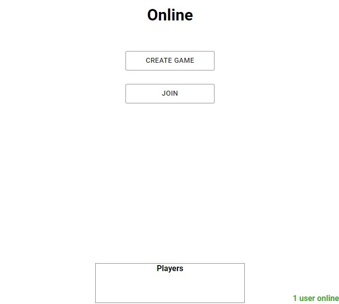
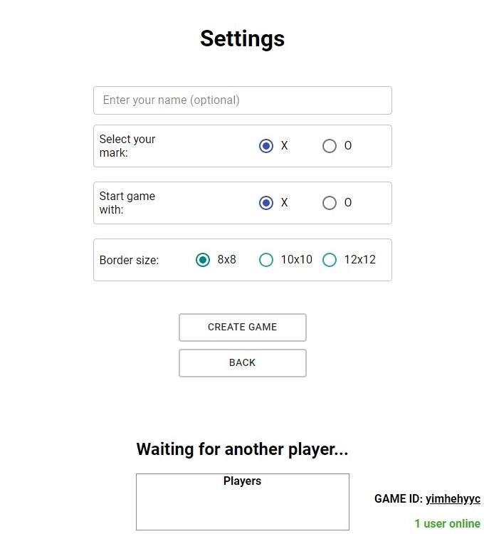
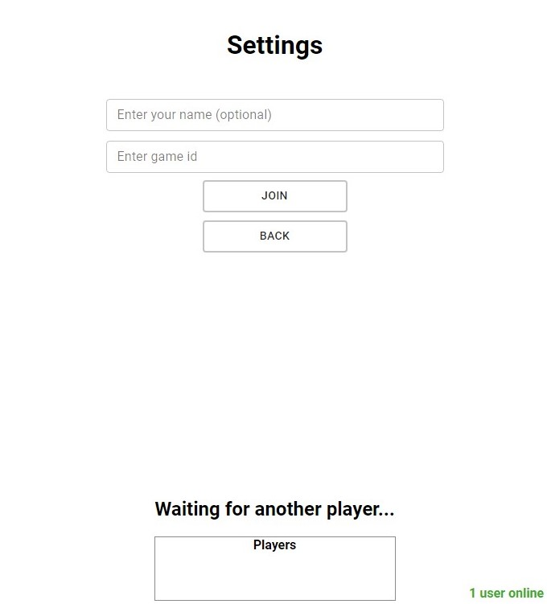

## Tic-tac-toe game

This project was bootstrapped with [Create React App](https://github.com/facebook/create-react-app).

## Description:

Tic-tac-toe game in a 8x8, 10x10 or 12x12 grid. Players may add their names and select what mark is going to be the first ("X" by default).

Next mark (X or O) and players name are shown.

The player who succeeds in placing five of their marks in a diagonal, horizontal, or vertical row is the winner.

When the game ends, players can restart the game. They will return to the "start page" where their names and the starter mark can be changed (names will be the same if previously added).

Tested in Chrome.

## Usage:

```
git clone "repository url"
cd "repository folder"
npm i
npm start
```

## Online:

Live server deployed on heroku. If it has any error, the code can be found here: [amoba-server](https://github.com/Yhunie-the-cat/amoba-server)

For online mode, 1 player must create the game ('host'), the other player must join to that game:


Host can decide game settings, such as marks and grid size (player who join will get the opposite mark).


When game is created, the server send a game id that is shown in the bottom right corner:


Player who select Join must give the right game id:


When the right game id is added and clicking Join the game will be start.

## How to calculate win:

With every click on the board, the game will check every square value around the clicked position in a 9\*9 field and put their values in a 2d array (let's call it matrix). If this field is out of the board, the game fill the matrix with 'null' values (else the game would be crash).

Next, the game will check patterns in the matrix (row, column, diagonal) and put these patterns into different arrays.

Finally these arrays are checked from position 0 to 4. If all this position has the same value the game will end and the winner is shown. If not, the game will increase the position and check again (from 0-4, to 1-5).

More visual explanation in: src/gamelogic/checkWinningPatterns.ts
