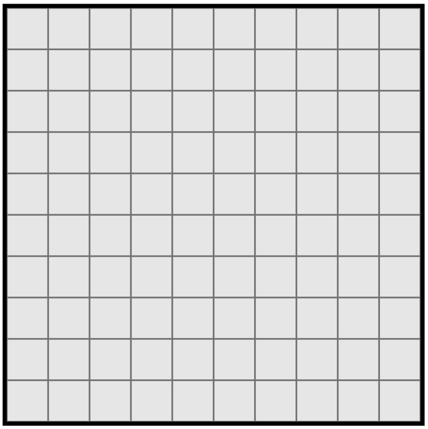
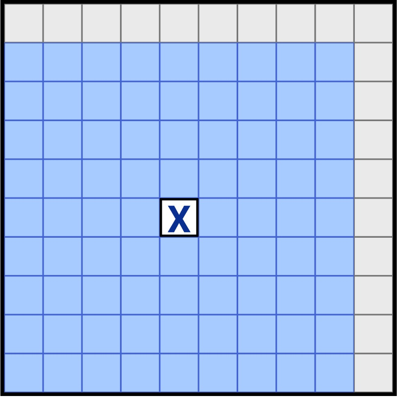
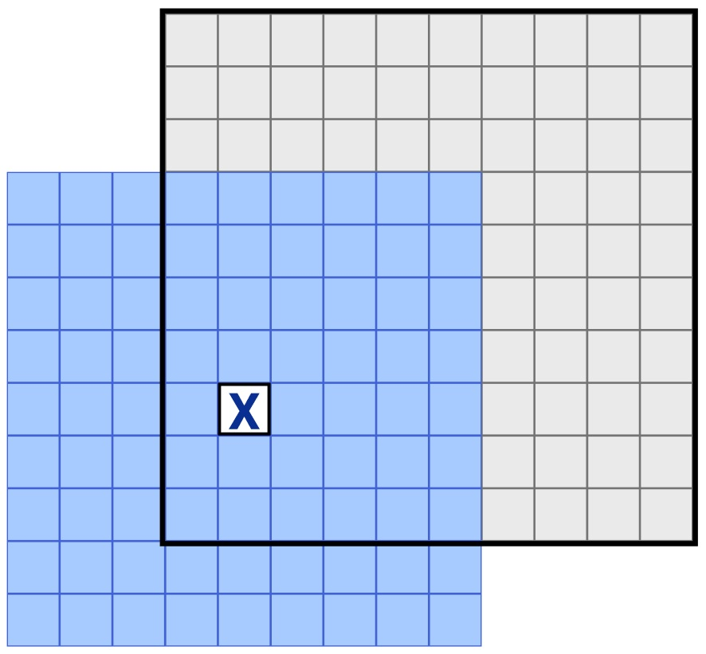
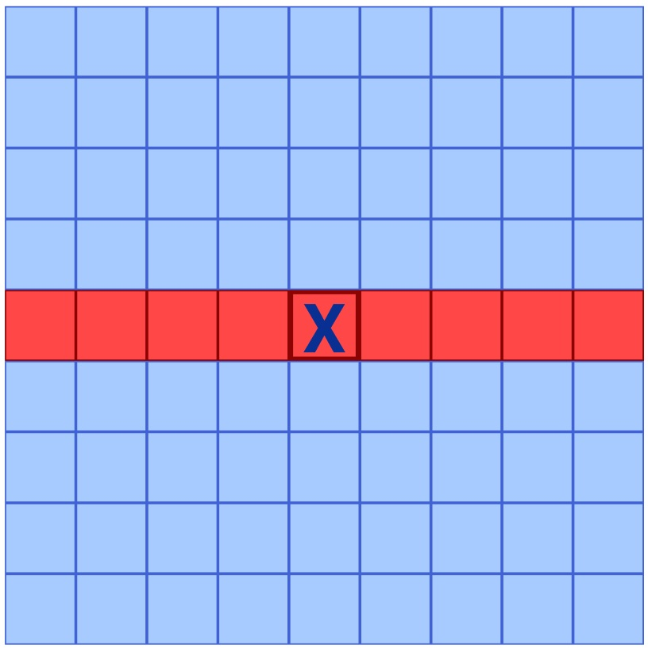
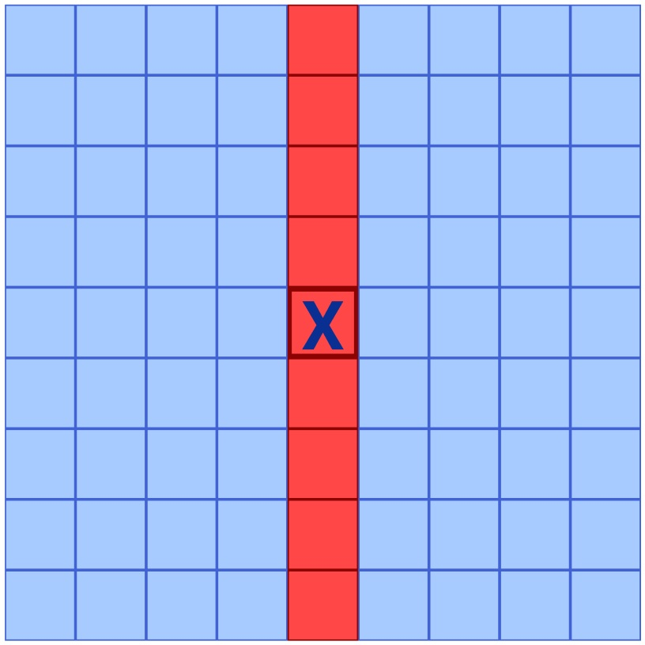
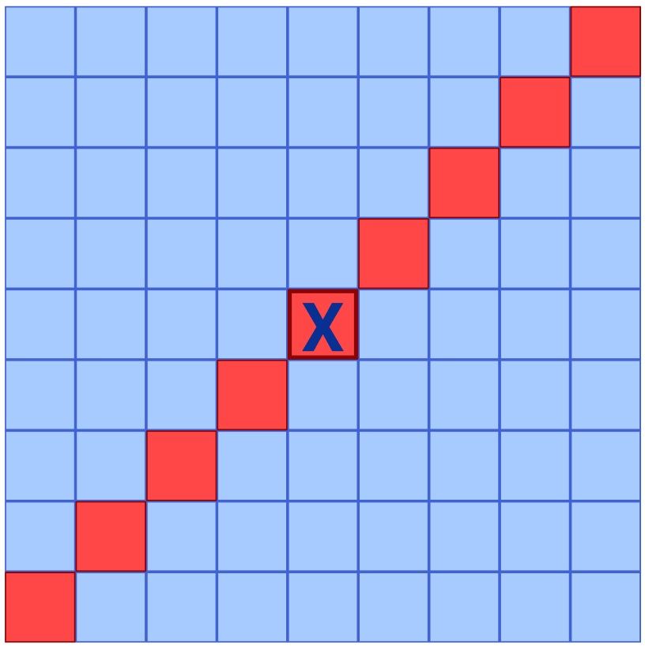
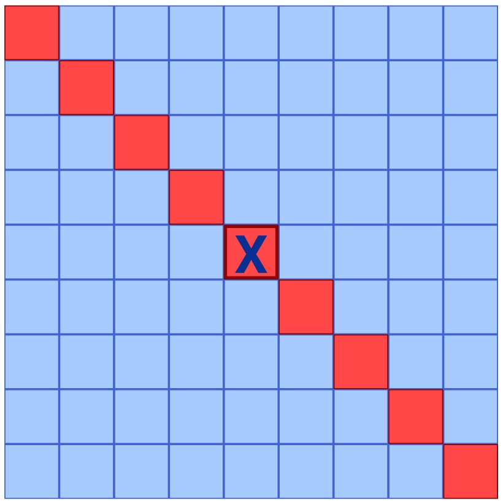

## 10x10 Tic-tac-toe game (Amőba)

This project was bootstrapped with [Create React App](https://github.com/facebook/create-react-app).

## Description:

Local tic-tac-toe game in a 10x10 grid. Players may add their names and select what mark is going to be the first ("X" by default).

Next mark (X or O) and players name are shown, above and below of the grid.

The player who succeeds in placing five of their marks in a diagonal, horizontal, or vertical row is the winner.

When the game ends, players can restart the game. They will return to the "start page" where their names and the starter mark can be changed (names will be the same if previously added).

## Usage:

```
git clone "repository url"
cd "repository folder"
npm i
npm start
```

## How to calculate win:

0.  Create a 2d array from the 10x10 grid:
    

    ```
    const allButton = [...document.querySelectorAll(".square-button")];

    const allButtonMatrix = [];
    while (allButton.length) allButtonMatrix.push(allButton.splice(0, 10));
    ```

1.  When a player put their mark anywhere on the grid, the game create a 9x9 grid around it and save their square values into an array:

    

    If this 9x9 grid falls outside of the original 10x10 grid, the game fills these squares with "null" values instead of getting an error or cut of the 9x9 grid (to 6x7 in this example):

    

    ```
    for (let i = rowIndexState - 5; i <= rowIndexState + 3; i++) {
      for (let j = colState - 5; j <= colState + 3; j++) {
        if (!allButtonMatrix[i] || !allButtonMatrix[i][j]) {
          allButtonValues.push("null");
        } else {
          allButtonValues.push(allButtonMatrix[i][j]);
        }
      }
    }
    ```

2.  After that, the game iterates through this array and get every value from row, column and 2 diagonal positions. These values are saved to 4 different arrays.

    

    ```
    // Row

    for (let i = 36; i < 45; i++) {
      fiveRow.push(allButtonValues[i]);
    }
    ```

    

    ```
    // Column

    for (let i = 0; i < allButtonValues.length; i++) {
      if ((i + 5) % 9 === 0) {
        fiveColumn.push(allButtonValues[i]);
      }
    }
    ```

    

    ```
    // Ascending (diagonal)

    for (let i = allButtonValues.length - 2; i > 0; i--) {
      if (i % 8 === 0) {
        fiveDiagonal.ascending.push(allButtonValues[i]);
      }
    }
    ```

    

    ```
    // Descending (diagonal)

    for (let i = 0; i < allButtonValues.length; i++) {
      if (i % 10 === 0) {
        fiveDiagonal.descending.push(allButtonValues[i]);
      }
    }
    ```

3.  The game iterates through these 4 arrays and get 5 of their values:\
    First, from position 0 to 4. If these 5 values are not the same then change position from 1 to 5. These steps are repeating till position 4 to 8. If 5 values are same the game is ends and the winner is shown above the 10x10 grid.

        const checkWin = (array) => {
            let values = [];

            for (let i = 0; i < array.length; i++) {
            values.push(array[i].value);
            }


            for (let i = 0; i <= 4; i++) {
                if (values.slice(i, i + 5).every((v) => v === "X")) {
                    dispatch(setWinner("X"));
                    //console.log("X win");
                }

                if (values.slice(i, i + 5).every((v) => v === "O")) {
                    dispatch(setWinner("O"));
                    //console.log("O win");
                }
            }
        };
